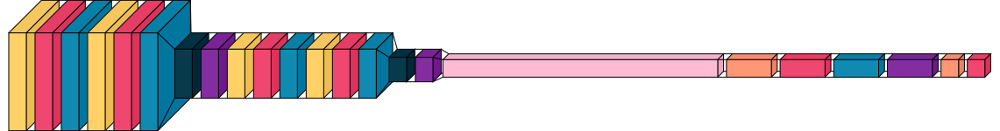
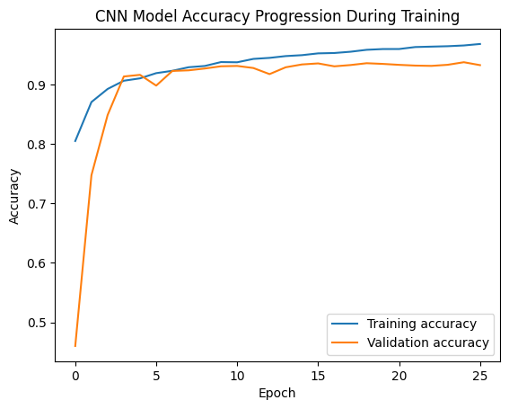
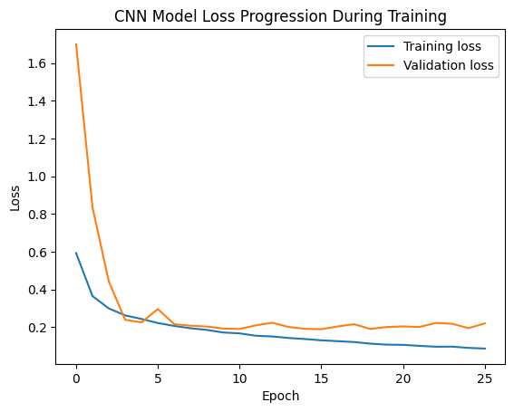

# Image Classification

This project is an image classification system to Fashion MNIST Datasets that uses two approaches: **Support Vector Classifier (SVC)** and **Convolutional Neural Network (CNN)**. This project also provides a **Streamlit** user interface to test the trained models.

## 1. Clone Repository
```sh
git clone https://github.com/almagribis/image-classification.git
cd image-classification
```

## 2. Install Requirements
Use Python version **3.10**, then install the required dependencies:
```sh
pip install -r requirements.txt
```

## 3. Training the Model

### a. Support Vector Machine (SVC)
SVC Model training can be seen in `notebook/SVCTrain.ipynb`.

**SVC Model Training Results:**
- The model is saved in `models/svc/model.pkl`
- Training results:

  | Accuracy | Precision | Recall | F1 Score |
  |----------|-----------|--------|----------|
  | 0.8828   | 0.8823    | 0.8828 | 0.8823   |
  
### b. Convolutional Neural Network (CNN)
CNN Model training can be seen in `notebook/CNNTrain.ipynb`.



**CNN Model Training Results:**
- The model is saved in `models/cnn/model.keras`
- Training Accuracy and Loss

  |                 Accuracy                |              Loss               |
  |-----------------------------------------|---------------------------------|
  |||


## 4. Running Streamlit UI
To test the model using the Streamlit interface, run the following command:
```sh
streamlit run app.py
```
Then, access the UI through the URL displayed in the terminal.
